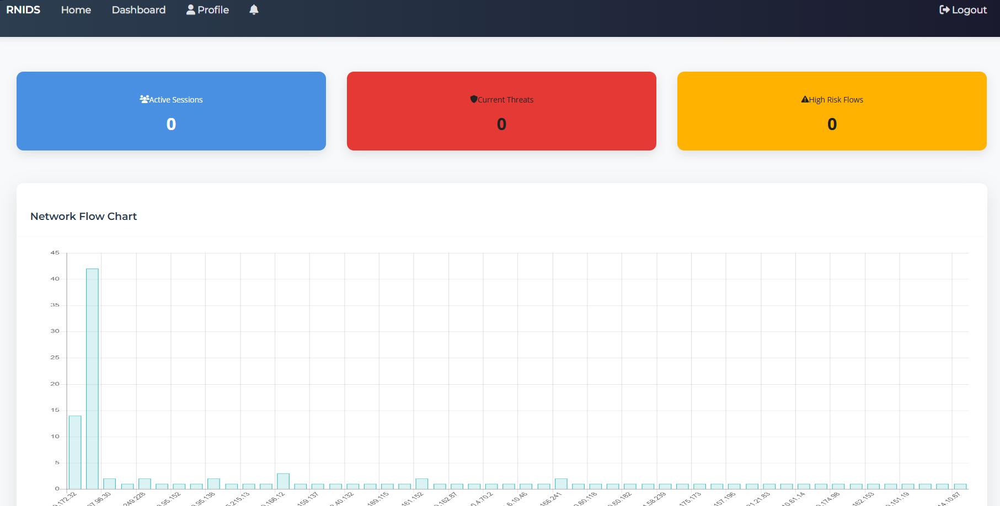

# NetMask Sentinel

Professional flow-based network intrusion detection and monitoring for authorized Windows environments.



## Overview

NetMask Sentinel captures IPv4 TCP and UDP traffic, groups packets into bidirectional flows, extracts a canonical 39-feature vector, and classifies each completed flow with the bundled random-forest model. Results are streamed to a local dashboard, assigned an explicit risk level, correlated into incidents, and recorded as local audit evidence.

This repository is intended for defensive monitoring, education, model evaluation, and authorized lab testing. It does not exploit systems, block traffic, prove attacker intent, or replace a professionally managed SIEM and incident-response program.

## Features

- Live Npcap/Scapy packet capture with a configurable BPF filter.
- Separate capture and inference workers with a bounded queue.
- Validated 39-feature model contract and finite-value checks.
- Eight bundled classes: Benign, Botnet, DDoS, DoS, FTP-Patator, Probe, SSH-Patator, and Web Attack.
- Explicit Minimal, Low, Medium, High, and Very High risk thresholds.
- Correlated incidents with event counts and acknowledgement state.
- Browser banners, toast messages, sound, and optional desktop notifications.
- Health, readiness, model metadata, capture telemetry, and incident APIs.
- Labeled CSV evaluation and authorized PCAP replay tools.
- Optional Firebase authentication and persistence.
- Optional LIME and autoencoder flow explanations.
- Safe, private-network-only lab traffic generator.

## How it works

```text
Network interface
    -> Npcap and Scapy capture
    -> bidirectional flow tracker
    -> 39 validated numeric features
    -> random-forest class probabilities
    -> attack probability and risk policy
    -> incident correlation
    -> dashboard, notifications, APIs, and CSV evidence
```

A flow completes when NetMask observes FIN/RST, the inactivity timeout expires, or the sensor shuts down. Risk is based on the total non-benign probability (`1 - P(Benign)`), not solely on the winning class.

## System requirements

### Required

- Windows 10 or Windows 11, 64-bit.
- Python 3.11 recommended; Python 3.10-3.12 supported.
- [Npcap](https://npcap.com/#download) installed with **WinPcap API-compatible mode** enabled.
- Administrator rights for the Npcap installation and, when required, starting its service.
- Approximately 3 GB free space for Python packages, models, logs, and build artifacts.

### Optional

- A modern Chromium, Firefox, or Edge browser for desktop notifications.
- Firebase project and service-account credentials for cloud accounts/history.
- Git for cloning and contributing.

Python 3.13+ is not currently supported because the optional TensorFlow explanation component does not support every newer Python runtime.

## Choose the right installation

| Situation | Recommended path |
|---|---|
| New sensor computer | Run `Install-NetMask.ps1 -InstallNpcap` as Administrator. |
| Existing development computer | Double-click `Start NetMask Sentinel.cmd`. |
| Second computer used only to test the sensor | Use the `NetMask-Remote-Lab-Test.zip` tester; it needs no Python. |
| Shared users and history across computers | Configure optional Firebase after confirming local operation. |

## Quick start: one click

1. Install Python 3.11 and enable **Add Python to PATH** during setup.
2. Install Npcap and enable **WinPcap API-compatible mode**.
3. Clone or download this repository.
4. Double-click `Start NetMask Sentinel.cmd`.

The launcher automatically:

- creates `.venv` when missing;
- installs or updates `requirements.txt` when it changes;
- verifies that Npcap is running;
- starts NetMask in the background;
- enables private-LAN testing on port 5000;
- opens the local guest dashboard.

Open the dashboard manually at:

```text
http://127.0.0.1:5000
```

Use `Stop NetMask Sentinel.cmd` to stop the recorded NetMask process safely.

When Windows Firewall prompts, allow Python on **Private networks only**. Never forward port 5000 through an internet router.

### New-computer setup

On a new Windows sensor computer, open **PowerShell as Administrator** in the
project folder and run:

```powershell
.\Install-NetMask.ps1 -InstallNpcap
```

The installer creates the virtual environment, installs Python requirements,
starts Npcap, and launches the sensor. It uses `winget` to install Python 3.11
or Npcap when they are absent; Windows may display administrator or package
consent prompts that must be accepted.

The script cannot bypass Windows UAC, Npcap's installer choices, or an
organization's software-installation policy. During Npcap setup, enable
**WinPcap API-compatible mode**. When Windows Firewall prompts, allow Python
on **Private networks only**.

After setup, open `http://127.0.0.1:5000/guest`. Local signup and login work
without Firebase: accounts are password-hashed and stored only in that
computer's ignored `runtime/accounts.sqlite3` file.

### Guaranteed authorized two-PC alert test

For a notification demonstration without sending an attack payload:

1. Start NetMask on the sensor computer.
2. Run `Show-LabAlertToken.ps1` on that computer and copy its token.
3. On the second private-network computer, use `Run Remote Lab Test.cmd`, pick
   **alert**, type `AUTHORIZED`, then enter the token.

The dashboard records the second computer's source IP as an **Authorized Lab
Alert** and displays the normal high-risk notification. This endpoint accepts
only private/loopback clients, requires the per-install token, and is available
only while development debug routes are enabled.

This is a notification and source-IP demonstration, not an attack. The test
tool contains no exploit, credential, malware, persistence, evasion, or
destructive functionality.

### What traffic can a sensor see?

When installed on a workstation, NetMask sees traffic sent to or from that
workstation. It does not automatically see every device on a switched network.
For authorized network-wide visibility, deploy it at a gateway or use an
approved SPAN/mirror port or network TAP. The bundled classifier is limited to
its known classes and should be validated on representative authorized traffic;
it cannot guarantee detection of every attack.

## Manual installation

From PowerShell in the repository root:

```powershell
py -3.11 -m venv .venv
.\.venv\Scripts\Activate.ps1
python -m pip install --upgrade pip
python -m pip install -r requirements.txt
python application.py
```

If PowerShell blocks virtual-environment activation, activation is optional. Run the interpreter directly:

```powershell
.\.venv\Scripts\python.exe application.py
```

### Verify Npcap

```powershell
Get-Service npcap
```

The service status should be `Running`. If it is stopped, open an Administrator PowerShell window and run:

```powershell
Start-Service npcap
```

## Configuration

NetMask reads environment variables directly. Copy values from `.env.example` into the shell, service manager, or deployment environment; the application does not automatically load `.env` files.

| Variable | Default | Purpose |
|---|---:|---|
| `NETMASK_ENV` | `development` | Use `production` to enable strict production guards. |
| `NETMASK_HOST` | `127.0.0.1` | Bind address. The one-click launcher uses `0.0.0.0` for private lab testing. |
| `NETMASK_PORT` | `5000` | Dashboard/API port. |
| `FLASK_SECRET_KEY` | generated in development | Required with at least 32 characters in production. |
| `FLASK_DEBUG` | `false` | Enables Flask debugging only outside production. |
| `ENABLE_GUEST_ACCESS` | development only | Enables the local guest dashboard. |
| `ENABLE_DEBUG_ROUTES` | development only | Enables local simulation and diagnostic routes. |
| `CAPTURE_ENABLED` | `true` | Starts the live packet sensor. |
| `CAPTURE_INTERFACE` | default interface | Optional Scapy/Npcap interface name. |
| `CAPTURE_FILTER` | `ip and (tcp or udp)` | BPF packet filter. |
| `FLOW_TIMEOUT_SECONDS` | `120` | Inactivity period before a flow is completed. |
| `INCIDENT_WINDOW_SECONDS` | `120` | Correlation window for related detections. |
| `CORS_ORIGINS` | localhost URLs | Comma-separated exact browser origins. |
| `FIREBASE_CREDENTIALS` | `firebase-adminsdk.json` | Optional service-account JSON path. |
| `NETMASK_LAB_ALERT_TOKEN` | generated by launcher | Token required by the remote authorized-lab **alert** profile. |

## Firebase (optional)

NetMask works locally without Firebase. To enable cloud authentication and history:

1. Create a Firebase project and enable Firestore.
2. Create a service account with only the permissions required by your environment.
3. Store its JSON file outside the repository.
4. Set `FIREBASE_CREDENTIALS` to the absolute file path.
5. Configure and audit Firestore security rules before deployment.

Never commit service-account JSON, API secrets, access tokens, packet captures containing personal data, or production logs.

## Test on the same computer

Start NetMask, then double-click `Run Remote Lab Test.cmd` and use:

```text
Target: 127.0.0.1
Profile: baseline, burst, or discovery
Confirmation: AUTHORIZED
```

Or run the source directly:

```powershell
.\.venv\Scripts\python.exe netmask_lab_traffic.py --target 127.0.0.1 --mode baseline --authorized-lab-use
```

For a guaranteed notification-interface simulation in development:

```powershell
.\.venv\Scripts\python.exe safe_traffic_test.py --mode mock --host 127.0.0.1 --port 5000
```

The simulation validates notification delivery; it is not model inference. Real traffic profiles may correctly be classified as benign.

## Test from a second private-network computer

1. Start NetMask on the sensor computer.
2. Run `ipconfig` and note its RFC1918 address, such as `192.168.1.5`.
3. Build or download the `NetMask-Remote-Lab-Test` artifact.
4. Extract the entire ZIP on the second Windows computer.
5. Double-click `Run Remote Lab Test.cmd`.
6. Enter the sensor's private address, select a profile, and type `AUTHORIZED`.

Choose **alert** for a guaranteed dashboard notification. Before running it,
copy the token printed by `Show-LabAlertToken.ps1` on the sensor computer. The
alert reports the second computer's actual source IP in the incident and the
flow table. Choose baseline, burst, or discovery to validate real packet
capture; those profiles can correctly be classified as benign.

The standalone tester requires no Python installation. It refuses public targets and contains no exploits, credential attempts, malware, persistence, evasion, or destructive actions.

## Model validation

Validate the serialized model contract:

```powershell
.\.venv\Scripts\python.exe evaluate_model.py --smoke
```

Evaluate an independent labeled CSV containing the canonical feature columns and a `Label` column:

```powershell
.\.venv\Scripts\python.exe evaluate_model.py labeled-flows.csv --output reports\evaluation.json
```

The report includes evaluated/invalid row counts, balanced accuracy, per-class precision/recall/F1, confusion matrix, attack average precision, and risk distribution.

The bundled legacy model probabilities are not calibrated. Do not publish an accuracy claim until the model is evaluated on independent traffic representative of the intended network.

## Authorized PCAP replay

```powershell
.\.venv\Scripts\python.exe replay_pcap.py capture.pcap --output reports\pcap-replay.jsonl
```

Only replay packet captures that you own or are explicitly authorized to analyze. Treat PCAPs as sensitive data.

## Health and operational APIs

| Endpoint | Authentication | Purpose |
|---|---|---|
| `GET /health/live` | No | Confirms that the web process is alive. |
| `GET /health/ready` | No | Reports model and capture readiness. |
| `GET /api/model` | Yes | Model hash, version, classes, features, and risk policy. |
| `GET /api/metrics` | Yes | Runtime, queue, capture, latency, and error counters. |
| `GET /api/incidents` | Yes | Correlated incident list and summary. |
| `POST /api/incidents/{id}/acknowledge` | Yes + CSRF | Acknowledges an incident. |
| `POST /api/lab-alert` | Private network + token | Development-only authorized notification test. |

Runtime evidence is written under `runtime/`, which is intentionally excluded from Git.

## Troubleshooting

| Symptom | Check |
|---|---|
| Installer reports no Python | Install Windows App Installer/`winget`, reopen PowerShell, then rerun `Install-NetMask.ps1`. |
| Sensor is not ready | Run `Get-Service npcap`; start it in an elevated PowerShell with `Start-Service npcap`. |
| Another PC cannot reach the sensor | Confirm both PCs are on the same private network, use the sensor's `ipconfig` address, and allow port 5000 on Private firewall networks. |
| Dashboard shows no external PCs | Install the sensor on the destination PC or use an authorized SPAN/TAP/gateway deployment. |
| Alert profile gets `401` or `404` | Restart the sensor in development mode, run `Show-LabAlertToken.ps1`, and enter that exact token on the tester. |
| Detail page says explanations are unavailable | Core flow fields and IPs still render. TensorFlow/LIME explanation assets are optional. |

## Automated tests

```powershell
$env:CAPTURE_ENABLED = 'false'
.\.venv\Scripts\python.exe -m unittest discover -v
.\.venv\Scripts\python.exe evaluate_model.py --smoke
node --check static\js\application.js
```

## Build the standalone lab tester

Install development dependencies and run the reproducible build script:

```powershell
.\.venv\Scripts\python.exe -m pip install -r requirements-dev.txt
.\build_remote_tester.ps1
```

The resulting ZIP is written to `dist/NetMask-Remote-Lab-Test.zip`. GitHub Actions also publishes this artifact through the **Build remote lab tester** workflow.

## Project structure

```text
application.py                 Flask and Socket.IO application
netmask/                       detection, capture, incidents, telemetry, config
flow/                          packet-to-flow feature calculations
models/                        bundled serialized model artifacts
templates/ and static/         dashboard interface
tests/                         unit and route tests
evaluate_model.py              labeled dataset evaluation
replay_pcap.py                 authorized offline PCAP replay
netmask_lab_traffic.py         bounded private-network lab traffic generator
Start-NetMask.ps1              one-click Windows launcher implementation
build_remote_tester.ps1        reproducible standalone tester build
```

See `docs/ARCHITECTURE.md` for a beginner-friendly technical explanation.

## Production guidance

The included Flask/Werkzeug server is for local and controlled lab use. Before any production deployment:

- use a supported production WSGI/Socket.IO deployment architecture;
- terminate TLS at a trusted reverse proxy;
- set `NETMASK_ENV=production` and a strong `FLASK_SECRET_KEY`;
- disable guest access and debug routes;
- use exact CORS origins and private network controls;
- run capture with the minimum operating-system privileges;
- centralize logs without storing unnecessary personal data;
- protect models and credentials with access controls;
- establish alert triage, retention, and incident-response procedures.

## Limitations

- Default capture covers IPv4 TCP and UDP only.
- Encrypted payload content is not inspected.
- Process attribution is best-effort and may require elevated privileges.
- In-memory incidents reset when the process restarts.
- Model classes are limited to those represented by the bundled classifier.
- Traffic generation verifies capture and processing but does not guarantee an attack classification.

## Responsible use

Use NetMask Sentinel only on computers and networks you own or have explicit authorization to monitor and test. Follow local law, organizational policy, privacy requirements, and data-retention rules.

## Security and contributing

- Read `SECURITY.md` before reporting a vulnerability.
- Read `CONTRIBUTING.md` before submitting changes.
- All contributors must follow `CODE_OF_CONDUCT.md`.

## License

Released under the MIT License. See `LICENSE`.
